# 数据结构

### 数组

- 由相同类型的元素组成

- 由一块【连续】的内存来存储

- 创建以后大小固定，不能再改变

- 利用元素的索引可以访问数组元素（随机访问）

  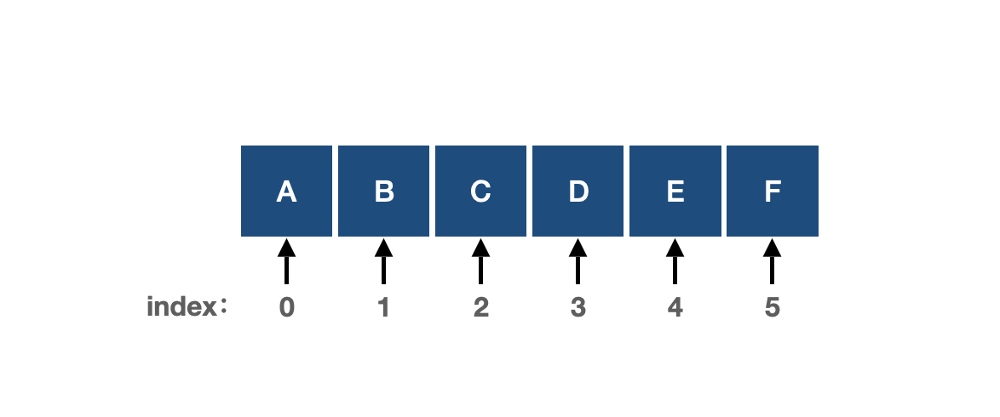

  > **优点：**
  >
  > > 可以随机访问，访问元素时间复杂度为O(1)
  >
  > **缺点：**
  >
  > > 1，插入/删除复杂度为O(n)
  > >
  > > 2，容量大小固定，无法扩容
  
  
  
  ---

### 链表

- 线性表，不按线性的顺序存储
- 每一个节点里存【元素本身】和指向下一个节点的【指针】
- 链表有很多种不同的类型：单向链表，双向链表，循环链表，块状链表
- 链表用来构建许多其它数据结构，如堆栈，队列和他们的派生。

###### 单向链表

单向链表只可向一个方向遍历，最后一个节点指向null

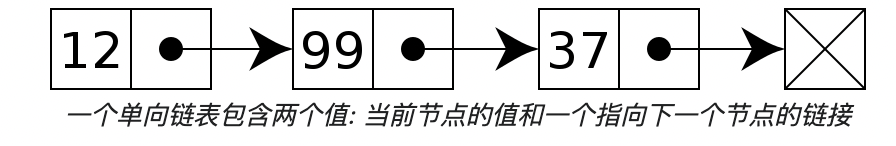

###### 双向链表

每个节点有两个连接：一个指向前一个节点，一个指向下一个节点

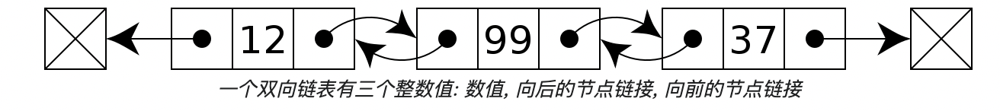

###### 循环链表

最后一个节点指向第一个节点的单向链表

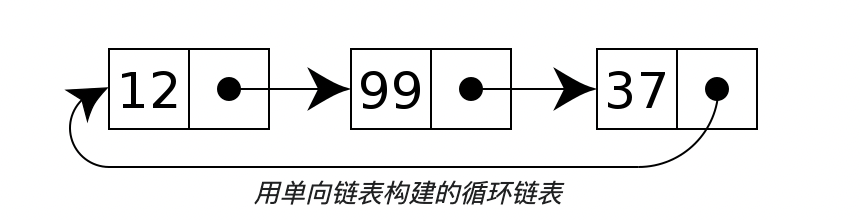

> **优点：**
>
> > 1，不要求预先分配空间，且不要求连续的内存，易扩容
> >
> > 2，插入/删除的时间复杂度为O(1)
> >
> > 

>**缺点：**
>
>> 1，增加了指针的存储空间
>>
>> 2，查找元素的时间复杂度为O(n)

###### 常见用途

常用于组织**检索较少，而删除、添加、遍历较多**的数据

---

### 栈

- 只允许在有序的线性集合的一端插入和删除数据
- Java中建议使用Deque来代替Stack类使用

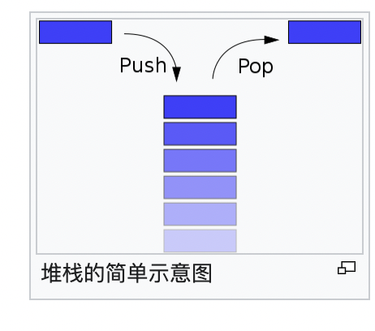

###### 常见用途

- Jvm虚拟机栈
- 进制转换
- 中缀表达式和后缀表达式/前缀表达式转换，后缀表达式计算

---

### 队列

- 队列是一个有序列表，可以用数组或是链表来实现
- 队列只允许在后端（称为*rear*）进行插入操作，在前端（称为*front*）进行删除操作

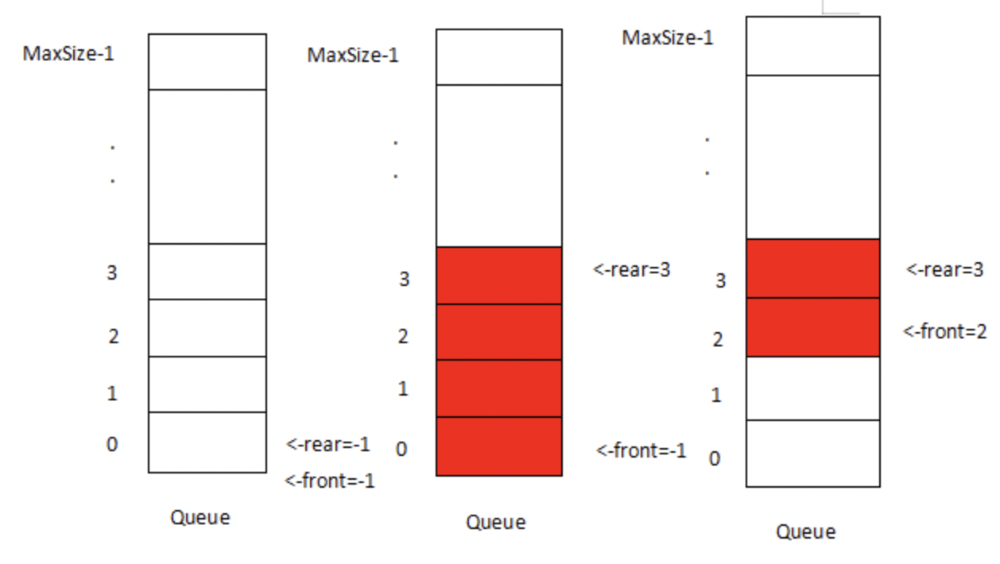

---

### 树

- 由n（n>0）个有限节点组成一个具有层次关系的集合
- 每一个非根节点有且只有一个父节点
- 树里面没有环路
- 每个节点都只有有限个子节点或无子节点

###### 常用术语

> 1. **节点的度**：一个节点含有的子树的个数称为该节点的度；
> 2. **树的度**：一棵树中，最大的节点度称为树的度；
> 3. **叶节点**或**终端节点**：度为零的节点；
> 4. **非终端节点**或**分支节点**：度不为零的节点；
> 5. **父亲节点**或**父节点**：若一个节点含有子节点，则这个节点称为其子节点的父节点；
> 6. **孩子节点**或**子节点**：一个节点含有的子树的根节点称为该节点的子节点；
> 7. **兄弟节点**：具有相同父节点的节点互称为兄弟节点；
> 8. 节点的**层次**：从根开始定义起，根为第1层，根的子节点为第2层，以此类推；
> 9. **深度**：对于任意节点n，n的深度为从根到n的唯一路径边的个数，根的深度为0；
> 10. **高度**：对于任意节点n，n的高度为从n到一片树叶的最长路径的边的个数，所有树叶的高度为0；
> 11. **堂兄弟节点**：父节点在同一层的节点互为堂兄弟；
> 12. **节点的祖先**：从根到该节点所经分支上的所有节点；
> 13. **子孙**：以某节点为根的子树中任一节点都称为该节点的子孙。
> 14. **森林**：由m（m>=0）棵互不相交的树的集合称为森林；

###### 树的种类

> - 无序树
>
>   > 树中任意节点的子节点之间没有顺序关系，由多个节点都可以当作根节点构成一棵树
>
> - 有序树
>
>   > - 二叉树
>   >
>   >   > 每个节点最多含有两个子树的树称为二叉树
>   >   >
>   >   > - 二叉树的第i层至多有2i-1个结点
>   >   > - 深度为k的二叉树至多有2k-1个结点
>   >   > - 对任何一棵二叉树T，度为0的结点数为n0，度为2的结点数为n2，则n0=n2+1
>   >
>   >   - 完全二叉树
>   >
>   >     > 对于一棵二叉树，假设其深度为d（d>1）。除了第d层外，其它各层的节点数目均已达最大值，且第d层所有节点从左向右连续地紧密排列，这样的二叉树被称为完全二叉树
>   >
>   >     - 满二叉树
>   >
>   >       > 对于一棵二叉树，假设其深度为d（d>1）。除了第d层外，其它各层的节点数目均已达最大值，且第d层所有节点从左向右连续地紧密排列，这样的二叉树被称为完全二叉树
>   >
>   >   - 平衡二叉树｜AVL树
>   >
>   >     > 两棵子树的高度差不大于1的二叉树
>   >
>   >   - 二叉查找树｜排序二叉树｜二叉搜索树｜有序二叉树｜Binary Search Tree
>   >
>   >     > - 1) 若左子树不空，则左子树上所有结点的值均小于它的根结点的值；
>   >     > - 2) 若右子树不空，则右子树上所有结点的值均大于或等于它的根结点的值；
>   >     > - 3) 左、右子树也分别为二叉排序树；
>   >     > - 4) 没有键值相等的节点
>   >
>   >   - 平衡查找树
>   >
>   >     > 自平衡的查找树
>   >
>   > - 
>   >
>   > - 霍夫曼树｜最优二叉树
>   >
>   >   > 带权路径最短的二叉树称为哈夫曼树
>   >
>   > - B树（MogoDB索引使用）
>   >
>   >   > 一种对读写操作进行优化的自平衡的多叉查找树，能够保持数据有序，拥有多于两个子树
>   >   >
>   >   > B树是对二叉查找树的改进
>   >   >
>   >   > 它的设计思想是，将相关数据尽量集中在一起，以便一次读取多个数据，减少硬盘操作次数
>   >   >
>   >   > 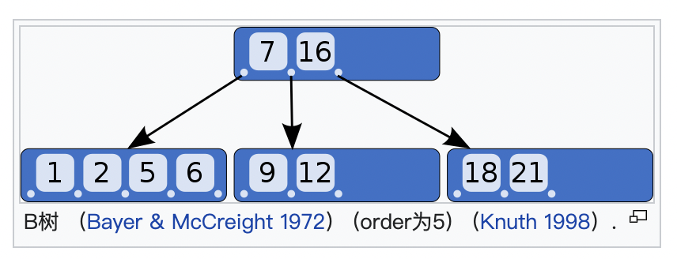
>   >
>   > - B+树（Mysql索引使用）
>   >
>   >   >- B-Tree的改进版本，可以查找连续的数据。
>   >   >
>   >   >- 数据都在叶子节点上，增加了顺序访问指针，每个叶子节点都指向相邻的叶子节点的地址
>   >   >
>   >   >- 相比B-Tree来说，进行范围查找时只需要查找两个节点，进行遍历即可
>   >   >
>   >   >
>   >   >
>   >   >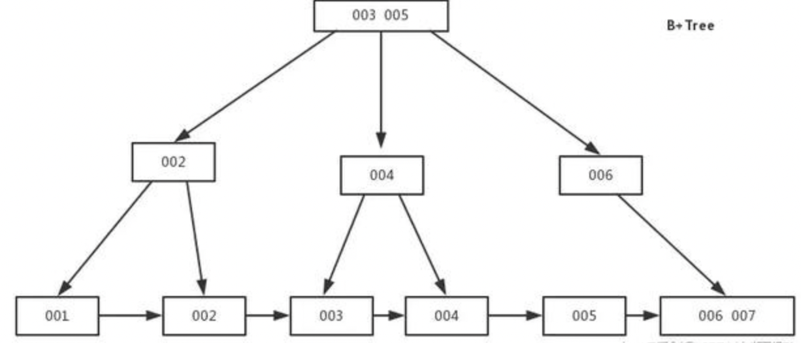
>   >
>   > - 红黑树（IO多路复用epoll的实现采用红黑树组织管理sockfd，java中TreeMap，jdk1.8的hashmap的实现）
>   >
>   >   > 带有颜色属性的二叉查找树，颜色为红色或黑色
>   >   >
>   >   > - 节点是红色或黑色。
>   >   >
>   >   > - 根是黑色。
>   >   >
>   >   > - 所有叶子都是黑色（叶子是NIL节点）。
>   >   >
>   >   > - 每个红色节点必须有两个黑色的子节点。（从每个叶子到根的所有路径上不能有两个连续的红色节点。）
>   >   >
>   >   > - 从任一节点到其每个叶子的所有简单路径都包含相同数目的黑色节点。
>   >   >
>   >   >   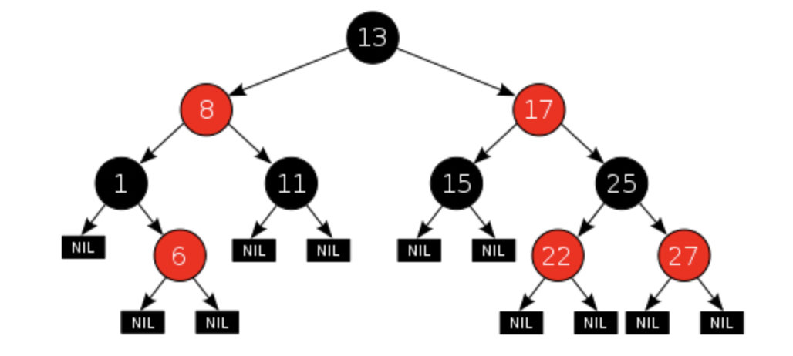
>   >
>   > - trie 树｜字典树（前缀匹配）
>   >
>   >   > 一个节点的所有子孙都有相同的前缀，也就是这个节点对应的字符串，而根节点对应空字符串。一般情况下，不是所有的节点都有对应的值，只有叶子节点和部分内部节点所对应的键才有相关的值
>   >   >
>   >   > 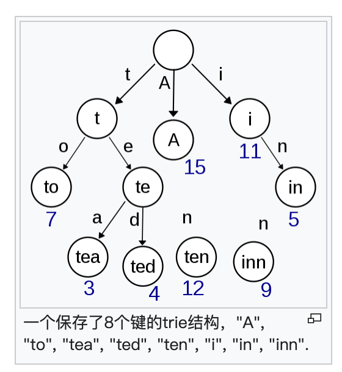
>
> 

---

### 图

线性表中，数据元素之间仅有线性关系；树形结构，数据元素之间有层次关系；而在图形结构中，数据元素之间的关系是任意的，任意两个数据元素之间可能相关也可能不想关。

###### 图的定义

###### 二元组的定义

一张**图**  是一个二元组，其中称为顶点集，称为边集。它们亦可写成和。的元素是一个二元组数对，用表示，其中。

###### 三元组的定义

一张**图**  是一个三元组，其中称为顶集（Vertices set），称为边集（Edges set）}与不相交；称为关联函数，将中的每一个元素映射到。如果那么称边连接顶点，而则称作的端点，此时关于相邻。同时，若两条边有一个公共顶点，则称关于相邻。

###### 基本概念

- 完全图

每一对不同的顶点都只有一条边相连，如果是有向图，则每个方向一条边。

- 连通图

图中任意两个顶点之间都有边连接可达

  - 极大连通子图（讨论的是图。再加入一个顶点，不再连通）

    - 连通图的极大就是自己，
    - 非连通就是拆成多个连通的连通分量，每个连通分量都是极大连通子图

  - 极小连通子图（讨论的是生成树。再加入一条边，就存在环）

    - 带权的生成树，总权重最小的是最小生成树
    - 最小生成树的算法：**普里姆/克鲁斯卡尔算法**

- AOV-网（activity on vertex）

  - 有向图

  - 顶点表示活动，弧表示先后关系

  - 可以用来检测图中**是否存在环**（每次挑选一个入度为0的顶点和它所有以它为尾的弧，如果存在剩余顶点，则存在弧）

- AOE-网（activity on edge）

  研究的问题是：1)完成整项工程至少需要多长时间，2)哪些活动是影响工程进度的关键

  完成的最短时间是：从开始点到完成点最长的长度，即【**关键路径**】

  	- 有向图
   - 顶点表示事件，弧表示活动，权表示活动持续时间
   - 求关键路径的算法：……

- 最短路径（Dijikstra算法，floyd算法）

  - 单源点最短路径（Dijikstra算法）：给定带权有向图G和源点v，求从v到G中其余各顶点的最短路径

  - 任意顶点对的最短路径（floyd算法）

  

###### 图的分类（简单/复杂/有向图/无向图）

- 简单图

  - 没有两条边，它们所关联的两个点都相同
  - 每条边所关联的是两个不同的顶点

  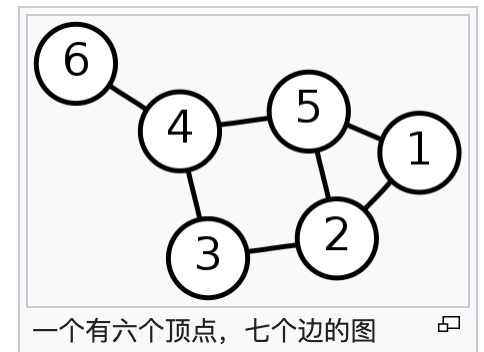

- 复杂图（多重图）

  - 允许两结点间的边数多于一条，
  - 允许顶点通过同一条边和自己关联

  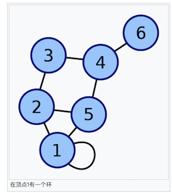

- 有向图

每条边规定有方向，有入边和出边之分，或者称为始点和终点之分。

- 无向图

每条边没有方向

- 完全图

任意两个顶点（不同的顶点）之间都有边相连

###### 图的存储方式

- [数组](https://zh.wikipedia.org/wiki/数组)（[邻接矩阵](https://zh.wikipedia.org/wiki/邻接矩阵)）存储表示（有向或无向）
- [邻接表](https://zh.wikipedia.org/wiki/邻接表)存储表示
- [前向星](https://zh.wikipedia.org/w/index.php?title=前向星&action=edit&redlink=1)存储表示
- [有向图](https://zh.wikipedia.org/wiki/有向图)的[十字链表](https://zh.wikipedia.org/wiki/十字链表)存储表示
- [无向图](https://zh.wikipedia.org/wiki/無向圖)的[邻接多重表](https://zh.wikipedia.org/w/index.php?title=邻接多重表&action=edit&redlink=1)存储表示

---

### 堆（常见的堆：二叉堆，斐波那契堆）

**堆**（英语：Heap）是一种特别的完全二叉树，即除了最底层，其他层的节点都被元素填满，且最底层尽可能地从左到右填入。满足以下特性

- 给定堆中任意节点P和C，若P是C的母节点，那么P的值会小于等于（或大于等于）C的值

最小堆：母节点的值恒**小于等于**子节点的值

最大堆：母节点的值恒**大于等于**子节点的值

在堆中最顶端的那一个节点，称作**根节点**（root node），根节点本身没有**母节点**（parent node）

##### 应用场景

- 排序（通常是二叉堆，算法称作堆排序）

### 散列表

**散列表**（**Hash table**，也叫**哈希表**），是根据**键**而直接访问在内存储存位置的数据结构。也就是说，它通过计算一个关于键值的函数，将所需查询的数据映射到表中一个位置来访问记录，这加快了查找速度。这个映射函数称做**散列函数**，存放记录的数组称做**散列表**。

- 若关键字为，则其值存放在的存储位置上。由此，不需比较便可直接取得所查记录。称这个对应关系为[散列函数](https://zh.wikipedia.org/wiki/散列函数)，按这个思想建立的表为**散列表**。

- 对不同的关键字可能得到同一散列地址，即}，而，这种现象称为**冲突**（英语：Collision）。具有相同函数值的关键字对该散列函数来说称做**同义词**。综上所述，根据散列函数和处理冲突的方法将一组关键字映射到一个有限的连续的地址集（区间）上，并以关键字在地址集中的“像”作为记录在表中的存储位置，这种表便称为**散列表**，这一映射过程称为散列，所得的存储位置称：**散列地址**

- 若对于关键字集合中的任一个关键字，经散列函数映象到地址集合中任何一个地址的概率是相等的，则称此类散列函数为[均匀散列函数](https://zh.wikipedia.org/w/index.php?title=均匀散列函数&action=edit&redlink=1)（Uniform Hash function），这就使关键字经过散列函数得到一个“随机的地址”，从而减少冲突

散列表的**载荷因子 = 填入表中的元素个数 / 散列表的长度**

**载荷因子**是散列表装满程度的标志因子。越大，表明填入表中的元素越多，产生冲突的可能性就越大；反之，越小，标明填入表中的元素越少，产生冲突的可能性就越小。实际上，散列表的平均查找长度是载荷因子的函数，只是不同处理冲突的方法有不同的函数。

对于开放定址法，荷载因子是特别重要因素，应严格限制在0.7-0.8以下。超过0.8，查表时的CPU缓存不命中（cache missing）按照指数曲线上升。因此，一些采用开放定址法的hash库，如Java的系统库限制了荷载因子为0.75，超过此值将resize散列表。

##### 散列函数的构造

- 直接定址法
- 数字分析法
- 平方取中法
- 折叠法
- 除留余数法

##### 处理冲突

- 开放定址法
- 单独列表法
- 再散列

